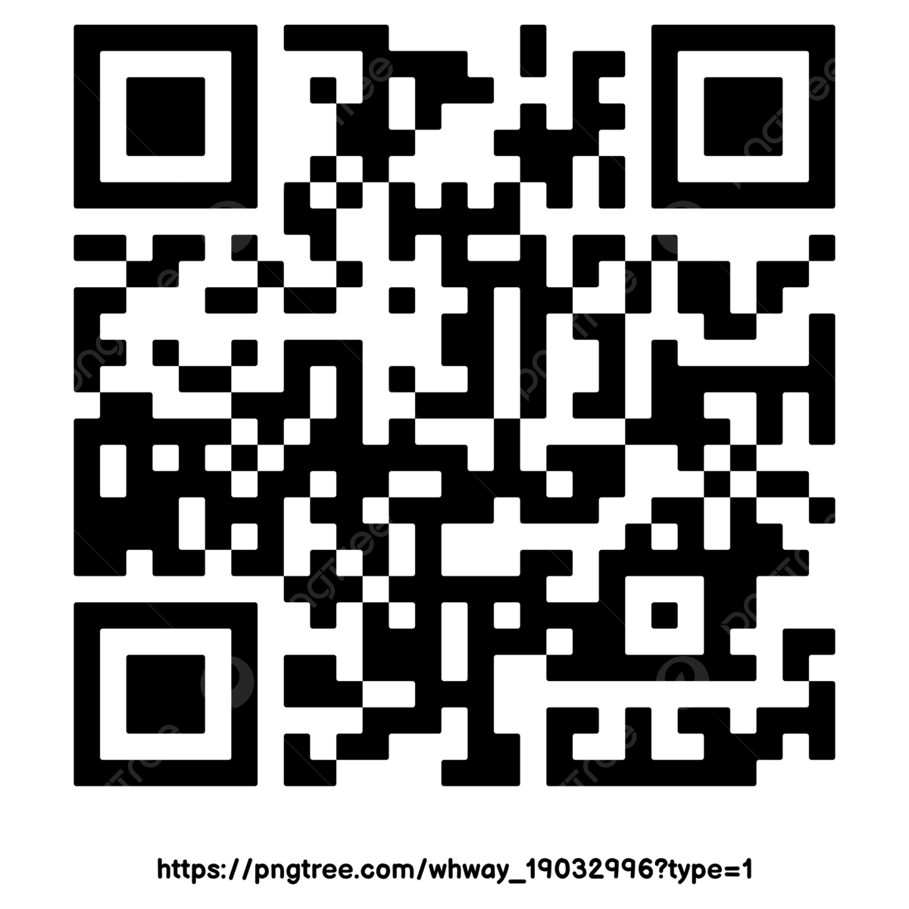

# 1. Headings

   How to give headings in Markdown file

# Hello World

## Secod Heading

### Third Heading

# 2. Block of words

thsi is a normal text in markdown

To add the sepcial text add > sign

> This is special text always use > sign before the text

> Second line

# 3. break line of code

This is the best python course where i have learned alot and .

 I will recommend this to everyone

# 4. Combine two things

> # The most important thing

# 5. Face of Text

**Bold Text**
  
*italic*

***Bold & Italic***

Or you can use symbol _ (underscore)

**Bold With Underscore** \
*italic with single underscore* \
***Bold & Italic with Underscore using 3 underscore***

# 6. Add Bullet Points

- Day 1
  - day Sub heading
- Day 2
- Day 3

> Numbering of the list ( Use 1. then write)

1. Day 1
2. Day 2
   1. Day 2.1
   2. Day 2.2
       1. Dayes
          1. more

> # An other  way is **using * or +**
>
- days
  - day1
    - day

- day2
  
# 7. Line Or page breaks

> ##you can use 3 Dashed (-) or  3-underscore ( _ ) or  3 estaric *
>
This is the line no 1
---

this is the line no 2
___
Now the thrid one is
***
Final one is now here.

# 8. Link & Hyperlink

[google Link] <https://www.google.com>

---
This is the google link.. [To search on the google](https://www.google.com)
***

[youtube]:https://www.youtube.com

> ### To check the complete course clikc [here]:[youtube]

<!--How you can do this-->
# 9. Images & figures with links

To join the course please scane the QR Code:



> ### This is the local directory Image..Syntex ==> ! [QR] (qr.png)

# Online image


# 10. Adding code Or code blokc

To Print a string `Print("Hello World")`
---

`print("Hello Programmmers")`
***

```
x=12 
y=34
print("The sum of x and y is ",x+y)

```

This will render as:

> ## This code shows the code color according to the C# Language
>

```C#
x = 12
y = 34
console.writeLine("The sum of {0} and {1} is", x + y)
```

> ## This code shows the code color according to the Python Language
>

```Python
x = 12
y = 34
print("The sum of x and y is", x + y)
```

# 11. Adding tables

| Customer Name | Species     | Petal_length | Sepal_length |
| ------------- | ----------- | :----------: | -----------: |
| Iris-setosa   | Iris-setosa |     4.3      |          3.0 |
| Iris-setosa   | Iris-setosa |     4.4      |          3.2 |
| Iris-setosa   | Iris-setosa |     5.8      |          4.9 |
| ---           | ---         |     ---      |          --- |

---

> ## ***This is how you can add table***

# Adding Contnet

> Systax `[]()`=> 1:Any Text, 2 Heading, remember add - which is representing the space
> 
[Goto Heading 2](#2-block-of-words)\
[Goto Heading 4](#4-combine-two-things)\
[Goto Heading 7](#7-line-or-page-breaks)\
[Goto Heading 5](#9-images--figures-with-links)
